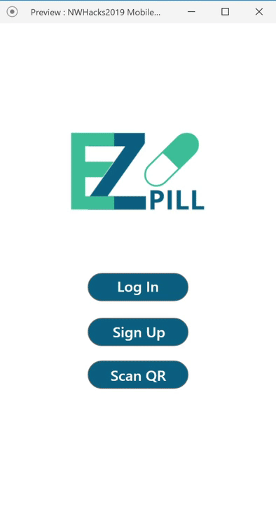

## NWHacks 2019 Project Repo

#### Project Description
75% of adults over the age of 50 take prescription medication on a regular basis. Of these people, over half do not take their medication as prescribed - either taking them too early (causing toxic effects) or taking them too late (non-therapeutic). This type of medication non-adherence causes adverse drug reactions which is costing the Canadian government over $8 billion in hospitalization fees every year. Further, the current process of prescription between physicians and patients is extremely time-consuming and lacks transparency and accountability.

EZPill is a platform that consists of a web application (for physicians) and a mobile app (for patients). Doctors first create a prescription in the web app by filling in information including the medication name and indications such as dosage quantity, dosage timing, total quantity, etc. This prescription generates a unique prescription ID and is translated into a QR code that practitioners can print and attach to their physical prescriptions. The patient then scans the QR code and all the prescription data will be automatically loaded to their patient account. Once the patient has signed up, the mobile app acts as a simple tracking tool while the medicines are consumed, but also serves as a quick communication tool to quickly reach physicians to either request a refill or to schedule the next check-up once all the medication has been consumed.

#### Components
* Back-end under the **api/** dir
* UI/UX assets live under the **UI ICONS/** dir
* Web Application (Doctors front-end) under the **web/** dir
* iOS Application (Patients front-end) under the **iOS/** dir

#### Collaborators 
* Felipe Ballesteros (febg) - UBC Electrical Eng.
* Nicholas Hui (NickHui) - UBC Mechanical Eng.
* Antione Torossoian (torossian97) - UBC Biomedical Eng.
* Adriano Sela Aviles (adrianosela) - UBC Computer Eng.
